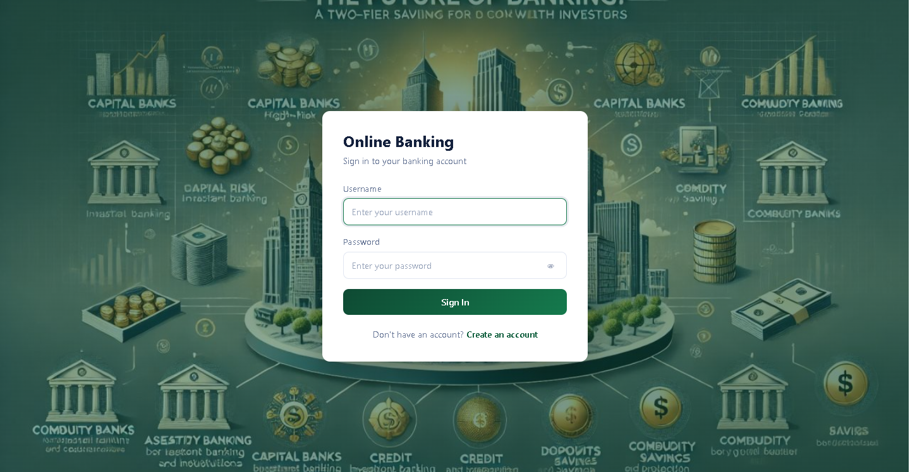
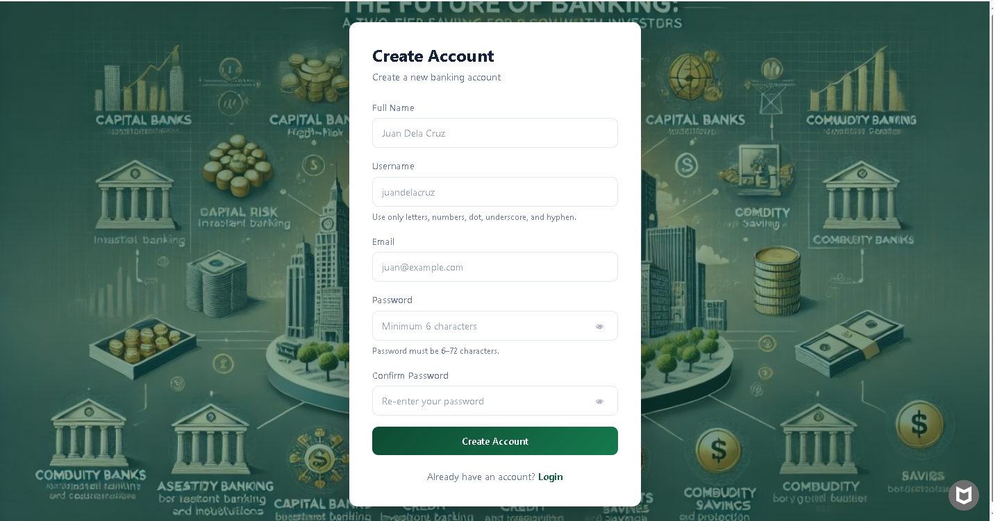
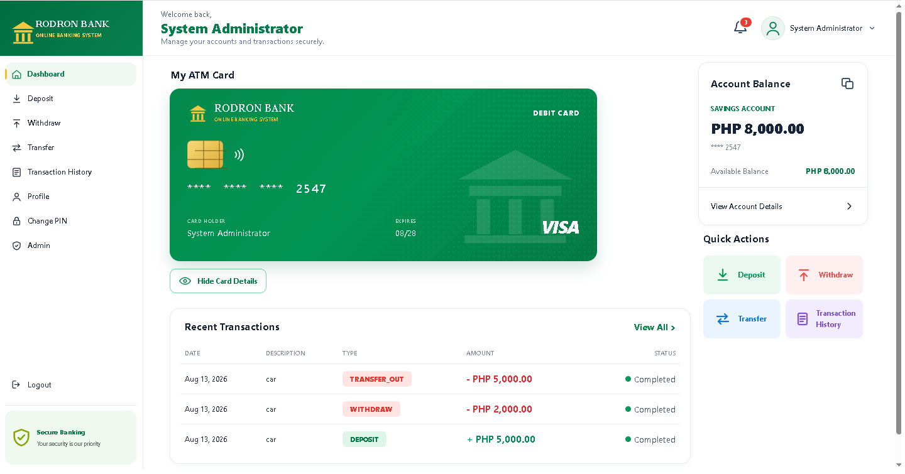
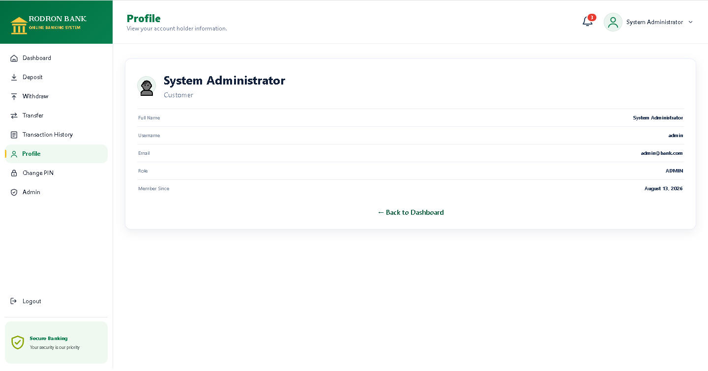
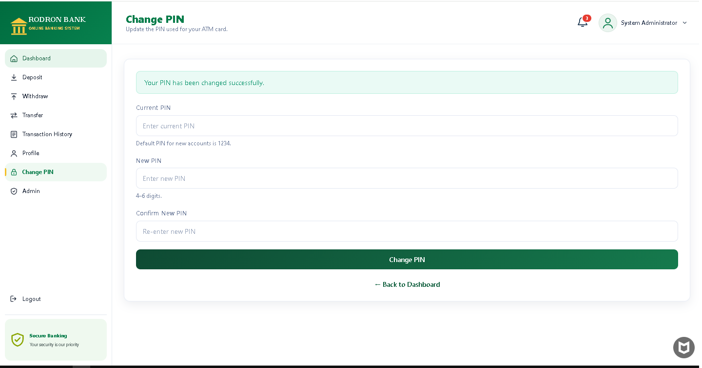
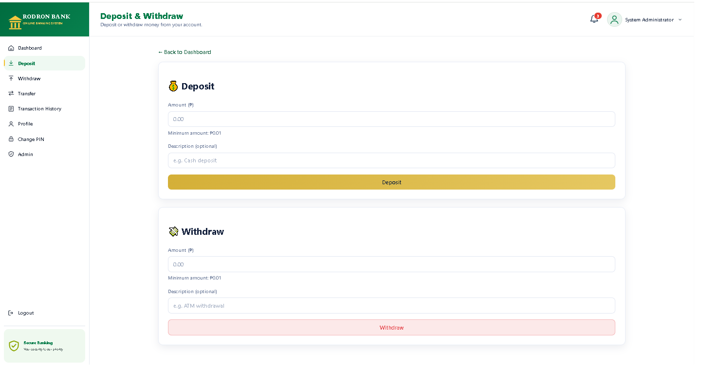
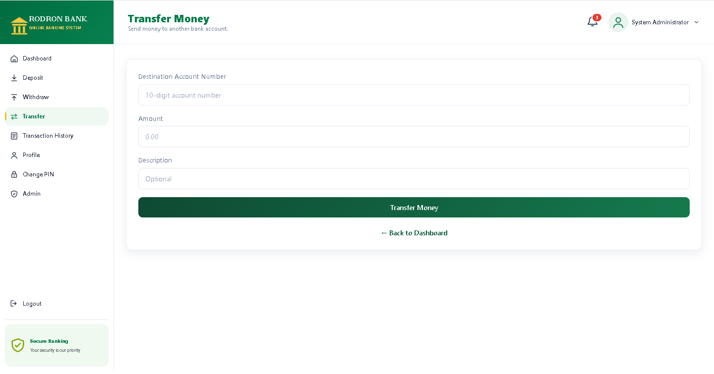
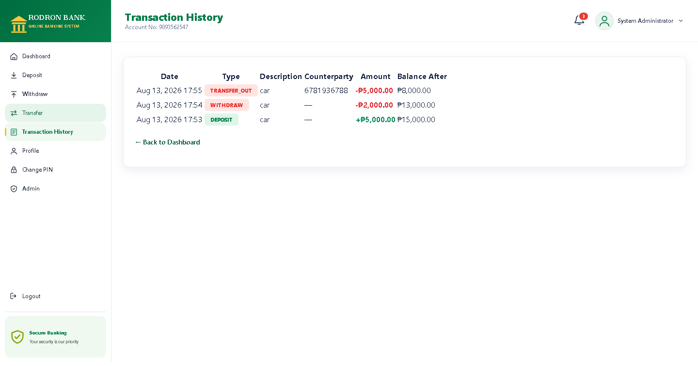
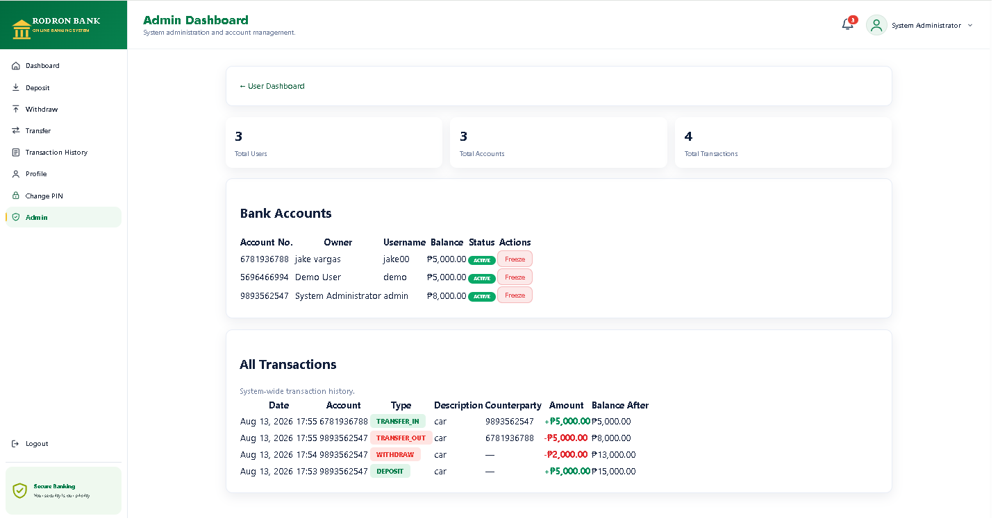

# 🏦 RODRON BANK – Online Banking System

A full-stack online banking system built with **Java Spring Boot, Thymeleaf, PostgreSQL, HTML, CSS, and JavaScript**.

This project demonstrates backend development, database integration, authentication, authorization, transaction processing, account management, security, responsive web interface design, and application deployment.

---

## 📌 Project Overview

**RODRON BANK** is a web-based banking application that simulates common online banking operations.

The system allows registered users to securely manage their bank accounts, perform financial transactions, view transaction history, manage their profiles, and change their PIN.

An administrative dashboard is also included for monitoring registered users, banking accounts, and transactions.

---

## 🚀 Features

### 👤 User Features

- User Registration
- User Login
- User Logout
- Account Dashboard
- View Account Balance
- View Account Information
- Profile Management
- Change PIN
- Deposit Money
- Withdraw Money
- Transfer Money
- Transaction History
- Account Status Management
- User-specific account information

### 💰 Banking Transactions

The system supports:

- Deposit
- Withdrawal
- Transfer
- Transfer In
- Transfer Out
- Transaction History
- Balance Validation
- Transaction Recording

### 🔐 Security Features

- Spring Security authentication
- BCrypt password hashing
- Role-based authorization
- Session-based authentication
- CSRF protection
- Protected banking pages
- User-specific access control
- Password validation
- Secure account access
- Environment-based database credentials

### 🛠️ Admin Features

- Admin Dashboard
- View registered users
- View banking accounts
- Monitor transactions
- View account information
- Administrative access control

---

## 🧰 Technology Stack

### Backend

- Java 21
- Spring Boot
- Spring MVC
- Spring Data JPA
- Spring Security
- Hibernate

### Frontend

- HTML5
- CSS3
- JavaScript
- Thymeleaf
- Bootstrap

### Database

- PostgreSQL

### Build Tools

- Apache Maven
- Maven Wrapper

### Development Tools

- Visual Studio Code
- IntelliJ IDEA
- Git
- GitHub
- DBeaver
- Postman

### Deployment

- Docker
- Render

---

## 🏗️ System Architecture

The application follows a layered architecture using Spring Boot.

```text
┌────────────────────────────────────┐
│             Frontend               │
│ Thymeleaf + HTML + CSS + JavaScript│
└──────────────────┬─────────────────┘
                   │
                   ▼
┌────────────────────────────────────┐
│           Controllers              │
│                                    │
│ AuthController                     │
│ DashboardController                │
│ TransactionController              │
│ AdminController                    │
└──────────────────┬─────────────────┘
                   │
                   ▼
┌────────────────────────────────────┐
│             Services               │
│                                    │
│ UserService                        │
│ AccountService                     │
│ TransactionService                 │
└──────────────────┬─────────────────┘
                   │
                   ▼
┌────────────────────────────────────┐
│           Repositories             │
│                                    │
│ UserRepository                     │
│ AccountRepository                  │
│ TransactionRepository              │
└──────────────────┬─────────────────┘
                   │
                   ▼
┌────────────────────────────────────┐
│           PostgreSQL               │
│                                    │
│ Users                              │
│ Accounts                           │
│ Transactions                       │
└────────────────────────────────────┘
```


## 📸 Application Screenshots

### 🔑 Login


### 📝 User Registration


### 📊 User Dashboard


### 👤 User Profile


### 🔐 Change PIN


### 💵 Deposit / Withdraw


### 🔄 Money Transfer


### 📜 Transaction History


### 🛠️ Admin Dashboard



## 🗄️ Database

The application uses PostgreSQL for persistent data storage.

Main Entities
Users

Stores registered user information and authentication details.

Accounts

Stores bank account information, including:

Account Number
Account Balance
Account Status
Account Owner
Transactions

Stores banking transaction information, including:

Transaction Type
Amount
Source Account
Destination Account
Transaction Date
Transaction Description

The database schema is available at:

sql/schema.sql

## 🔄 Transaction Processing
💵 Deposit

User
  │
  ▼
Deposit Request
  │
  ▼
Transaction Controller
  │
  ▼
Transaction Service
  │
  ▼
Account Validation
  │
  ▼
Balance Update
  │
  ▼
Transaction Record
  │
  ▼
PostgreSQL
💸 Withdrawal
User
  │
  ▼
Withdrawal Request
  │
  ▼
Transaction Controller
  │
  ▼
Transaction Service
  │
  ▼
Balance Validation
  │
  ▼
Balance Update
  │
  ▼
Transaction Record
  │
  ▼
PostgreSQL
🔄 Transfer
Sender
  │
  ▼
Transfer Request
  │
  ▼
Transaction Service
  │
  ├── Validate Sender
  │
  ├── Validate Receiver
  │
  ├── Check Balance
  │
  ├── Debit Sender
  │
  ├── Credit Receiver
  │
  └── Create Transaction Records
           │
           ▼
       PostgreSQL

## 🔐 Authentication and Authorization

The application uses Spring Security to protect banking functionality.

Authentication

Users must authenticate before accessing protected banking pages.

Login
  ↓
Spring Security
  ↓
Authentication
  ↓
Authorized User
  ↓
Protected Dashboard
Password Security

Passwords are not stored as plain text.

The application uses:

BCryptPasswordEncoder

to hash passwords before storing them in the database.

Role-Based Access

The system supports different user roles:

USER
ADMIN

Regular users can access their own banking functions, while administrators can access administrative features.

## 🛡️ Security Considerations

The application implements several basic security practices:

Password hashing using BCrypt
Spring Security authentication
Role-based authorization
CSRF protection
Protected banking pages
User-specific account access
Password validation
Environment-based database configuration
Sensitive environment files excluded using .gitignore

Database credentials should never be committed directly to GitHub.

This project is intended for educational and portfolio purposes. A production banking system would require additional security controls, encryption, auditing, monitoring, fraud detection, compliance, infrastructure security, and professional security testing.

## ⚙️ Configuration

The application uses environment variables for database configuration.

Expected environment variables:

DB_URL
DB_USERNAME
DB_PASSWORD

Example local configuration:

DB_URL=jdbc:postgresql://localhost:5432/banking_db
DB_USERNAME=postgres
DB_PASSWORD=your_password

Do not use real credentials in the README or source code.

## ▶️ How to Run

Prerequisites

Install the following:

Java 21
Maven
PostgreSQL
Git

Optional:

Docker
Visual Studio Code
IntelliJ IDEA
DBeaver
Postman